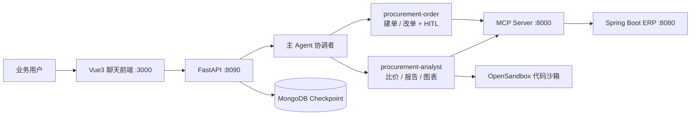

# 摩托车零部件智能采购系统（AI + ERP）

面向摩托车零部件采购场景的 **「传统 ERP + 多 Agent 对话助手」** 一体化方案：业务数据由 Java 后端统一管理，采购人员通过自然语言完成查数、比价分析、可控下单，无需在多系统与 Swagger 之间手工切换。

## 仓库结构

```
AI+ERP/
├── MotorcyclePartsProcurementSystem/   # Java ERP 后端（Spring Boot + MySQL）
├── ERP_OPENCLAW/                       # AI 层：LangGraph Agent、MCP、FastAPI、Vue 前端
├── 简历-项目经历-摩托车零部件AI采购系统.md   # 项目说明（STAR 法则，可作简历参考）
└── README.md                           # 本文件
```

| 子项目 | 说明 | 默认端口 |
|--------|------|----------|
| [MotorcyclePartsProcurementSystem](./MotorcyclePartsProcurementSystem/) | 供应商、零部件、订单、库存、客户、物流等 8 大业务模块 REST API | **8080** |
| [ERP_OPENCLAW](./ERP_OPENCLAW/) | LangGraph / DeepAgents 主 Agent + 子 Agent、MCP 桥接、流式 Web 对话 | MCP **8000**、API **8090**、前端 **3000** |

## 架构概览



**核心能力**

- **多 Agent 协作**：主 Agent 按意图委派「采购分析」与「采购订单」子 Agent（YAML 配置，见 `ERP_OPENCLAW/src/agent/subagents/configs/`）。
- **MCP 工具化**：FastMCP 将 Java REST API 封装为 `supplier_*` / `part_*` / `order_*` / `inventory_*` 等工具；图表能力通过魔塔 MCP 合并为 `generate_visualization`（26 类图表统一入口）。
- **长链分析**：分析子 Agent 在 OpenSandbox 内按 Skills 手册执行「查 ERP → 外网搜索 / 网页抓取 → Python 计算 → 生成 Markdown 报告」。
- **Human-in-the-Loop**：`order_create` / `order_update` 执行前中断审批，Vue `InterruptBanner` + MongoDB Checkpoint 支持 `/resume` 续跑。
- **上下文治理**：工具结果自动 Offload、窗口 Summarization、按用户隔离的 `/memories/{user_id}/preferences.md` 偏好记忆。

## 环境要求

| 组件 | 版本建议 |
|------|----------|
| JDK | 17+（ERP 子项目） |
| Maven | 3.6+ |
| MySQL | 8.0+ |
| Python | 3.10+ |
| Node.js | 18+（前端） |
| MongoDB | 4.4+（对话 Checkpoint，AI 层必需） |

可选：OpenSandbox 服务（代码沙箱，见 `ERP_OPENCLAW/src/agent/config.py` 中的 `SANDBOX_CONFIG`）。

## 快速启动（完整联调）

按以下顺序在 **4 个终端** 启动各服务（均需先完成对应子项目的依赖安装）。

### 1. 启动 ERP 后端

```bash
cd MotorcyclePartsProcurementSystem
# 按需修改 src/main/resources/application.yml 中的数据库账号
mvn spring-boot:run
```

- 首页：http://localhost:8080  
- Swagger：http://localhost:8080/swagger-ui.html  
- API 前缀：`http://localhost:8080/api`

首次启动会自动建库 `motorparts_db` 并灌入样例数据（约 30 家供应商、60 个零部件、120 条订单等）。详见 [MotorcyclePartsProcurementSystem/README.md](./MotorcyclePartsProcurementSystem/README.md)。

### 2. 启动 MCP 服务（桥接 Java API）

```bash
cd ERP_OPENCLAW
pip install -r requirements.txt
# 在 ERP_OPENCLAW 目录下，将 src 加入 PYTHONPATH 后启动
set PYTHONPATH=src          # Windows CMD
# export PYTHONPATH=src     # Linux / macOS
python -m mcp_server.server_main
```

- MCP 地址：http://127.0.0.1:8000/mcp  
- Java API 基址可在 `ERP_OPENCLAW/src/mcp_server/server_config.py` 中修改（默认 `http://localhost:8080/api`）。

### 3. 配置 AI 层环境变量

在 `ERP_OPENCLAW` 目录创建 `.env`（勿提交密钥到 Git），至少包含：

```env
DEEPSEEK_API_KEY=your_key
DEEPSEEK_BASE_URL=https://api.deepseek.com/v1
ZHIPU_API_KEY=your_key          # 网络搜索等
ZHIPU_BASE_URL=https://open.bigmodel.cn/api/paas/v4
```

并按需配置 MongoDB、OpenSandbox 等（修改 `ERP_OPENCLAW/src/agent/config.py` 或使用环境变量封装）。**请勿在公开仓库中填写真实内网 IP 与密码。**

### 4. 启动 Web（FastAPI + Vue）

```bash
cd ERP_OPENCLAW
python start_web.py
```

- 聊天界面：http://localhost:3000  
- API 文档：http://localhost:8090/docs  

`start_web.py` 会同时拉起后端（8090）与前端（3000）；**仍需保证步骤 1、2 中的 ERP 与 MCP 已运行**，否则 Agent 无法调用业务工具。

## 典型对话场景

| 用户意图 | 处理路径 |
|----------|----------|
| 查供应商 / 库存预警 / 零部件 | 主 Agent → `procurement-analyst` → MCP 查询 ERP |
| 比价、行情、采购分析报告 | 分析子 Agent + Skills + 图表 MCP + 可选网页抓取 |
| 创建 / 修改采购单 | 主 Agent → `procurement-order` → HITL 审批 → MCP 写回 ERP |
| 行业概念、市场资讯 | 主 Agent 直接 `web_search` |

## 技术栈

| 层级 | 技术 |
|------|------|
| ERP | Spring Boot 3、MyBatis Plus、MySQL、Swagger |
| AI 编排 | LangGraph、DeepAgents、LangChain |
| 工具协议 | FastMCP、`langchain-mcp-adapters` |
| Web | FastAPI、Uvicorn、Vue 3、Vite、SSE |
| 持久化 | MongoDB（`langgraph-checkpoint-mongodb`） |
| 沙箱 | OpenSandbox、`opensandbox-code-interpreter` |
| 大模型 | DeepSeek / 智谱 GLM（可配置） |

## 扩展开发

- **新增 ERP 接口**：在 Java 层增加 Controller → 在 `ERP_OPENCLAW/src/mcp_server/tools/` 注册 MCP 工具 → 在子 Agent YAML 的 `tools` 列表中声明。
- **新增分析流程**：在 `ERP_OPENCLAW/src/skills/procurement/` 下添加 `SKILL.md`，分析子 Agent 会按需 `read_file` 加载。
- **调整子 Agent 行为**：编辑 `ERP_OPENCLAW/src/agent/subagents/configs/*.yaml` 与 `ERP_OPENCLAW/src/agent/memory/AGENTS.md`。

## 相关文档

- [ERP 后端说明](./MotorcyclePartsProcurementSystem/README.md)
- [ERP API 文档](./MotorcyclePartsProcurementSystem/docs/API_DOCUMENTATION.md)
- [项目经历 / STAR 叙述](./简历-项目经历-摩托车零部件AI采购系统.md)
- AI 层依赖安装参考：[ERP_OPENCLAW/readme.txt](./ERP_OPENCLAW/readme.txt)

## 许可证

本项目仅供学习、演示与作品集使用。
